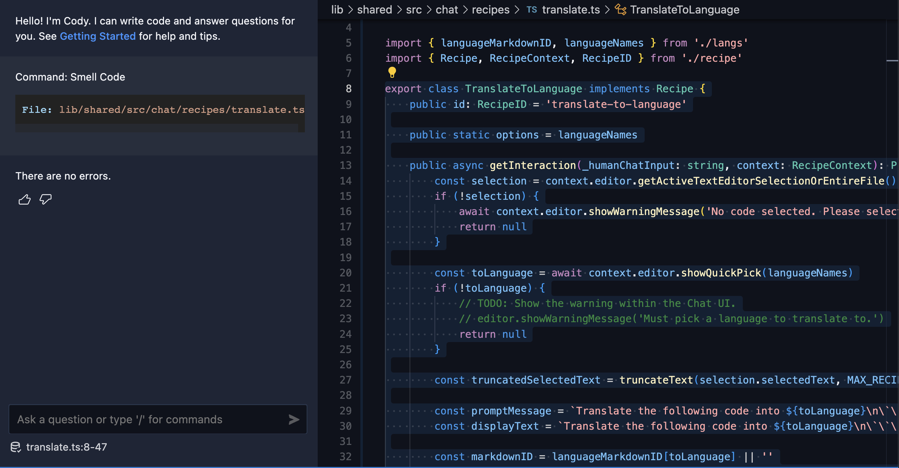
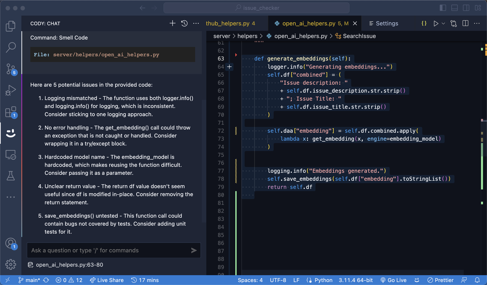

# Cody command: Code Smell

This command can be used to find potential issues in the code and any uncertain errors.

## Prompt

```json
  "Smell Code": {
        "prompt": "Find code smells, potential bugs, and unhandled errors in my selected code. Create a list with the top five errors you can find, and include a short informative description and suggestion for each. Please only respond with the list of errors and nothing else.'",
        "context": { "selection": true },
        "slashCommand": "smell code"
    }
```
> Copy the JSON above and paste it to the bottom of `~/.vscode/cody.json`.

## Examples



