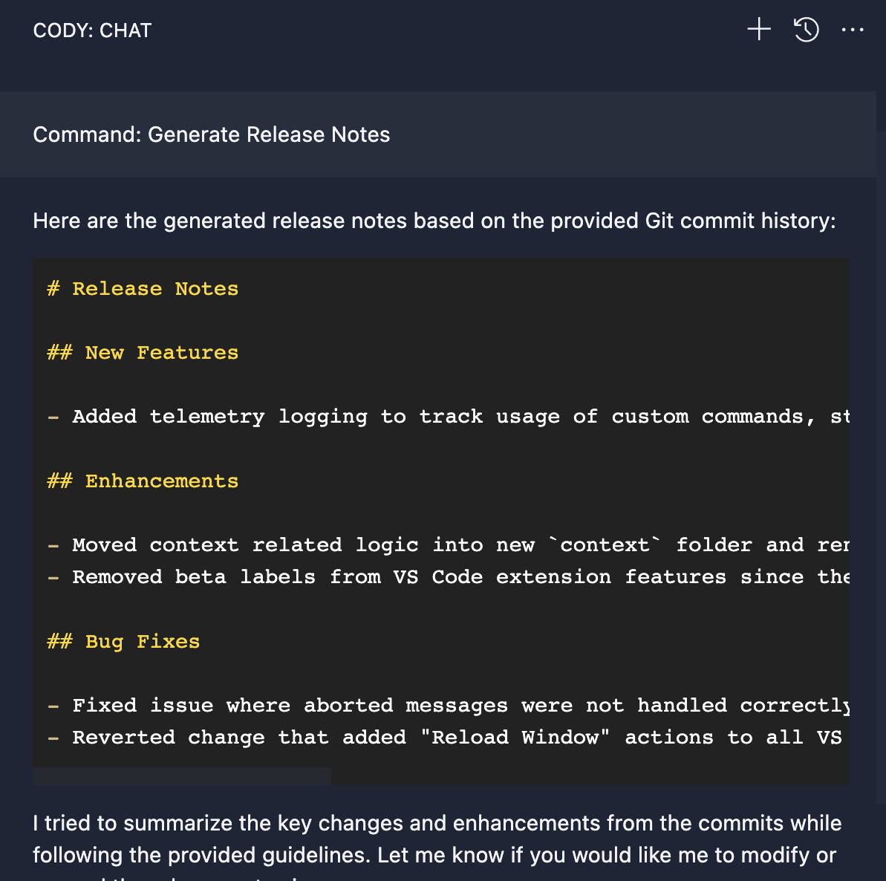

# Cody command: Generate Release Notes

This command can be used to generate release notes for a project based on commit messages for the past 1 week.

## Prompt

```json
  "Generate Release Notes": {
    "prompt": "Generate release notes by summarising the commits. Use proper heading format for the release notes. Do not include other changes and dependency updates.",
    "context": {
      "selection": false,
      "command": "git log --since='1 week' --pretty='Commit author: %an%nCommit message: %s%nChange description:%b%n'"
    }
  }
```
> Copy the JSON above and paste it to the bottom of `~/.vscode/cody.json`.

## Examples


