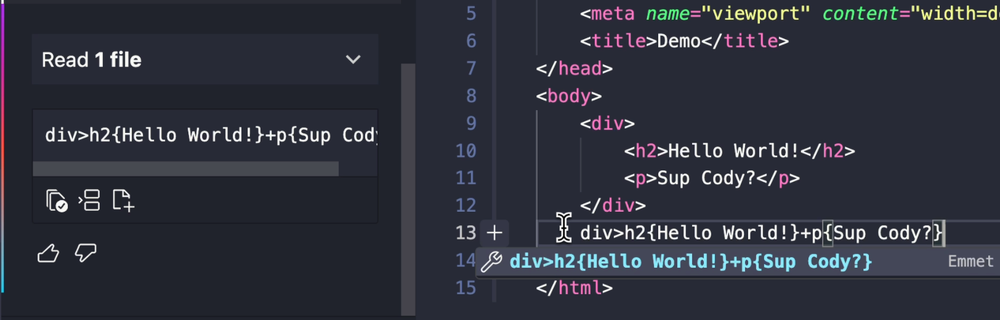

# Cody command: Convert HTML to Emmet Abbreviation

This command can be used to convert HTML to an Emmet Abbreviation.

## Prompt

```json
 "convert-html-to-emmet-abbreviation": {
      "description": "Convert HTML to Emmet Abbreviation",
      "prompt": "Convert the selected HTML code to an Emmet Abbreviation, Just give the answer, no follow up explanations.",
      "type": "user",
      "context": {
        "codebase": false,
        "selection": true
      }
}
```
> Copy the JSON above and paste it to the bottom of `~/.vscode/cody.json`.

## Examples



