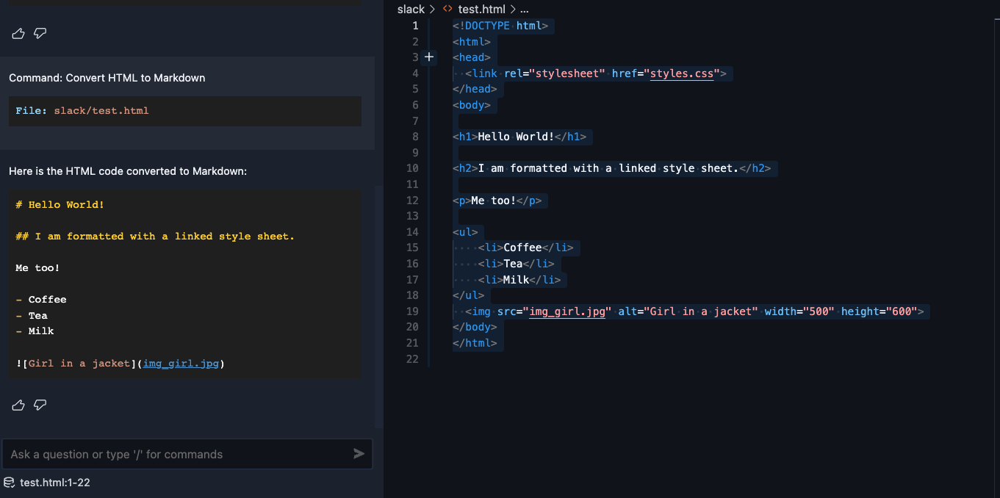

# Cody command: Convert HTML to Markdown

This command can be used to convert HTML to Markdown.

## Prompt

```json
"Convert HTML to Markdown": {
  "prompt": "Convert the selected HTML code to Markdown format, Just give the answer, no follow up explanations.",
  "context": {
    "codebase": false,
    "selection": true
  },
  "name": "Convert HTML to Markdown",
  "type": "user"
}
```
> Copy the JSON above and paste it to the bottom of `~/.vscode/cody.json`.

## Examples

https://storage.googleapis.com/sourcegraph-assets/blog/example_1.mp4


