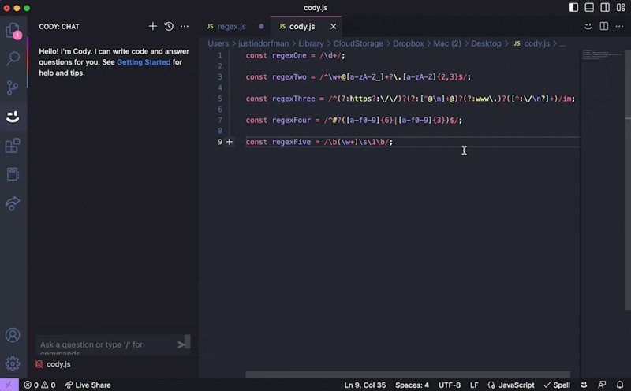
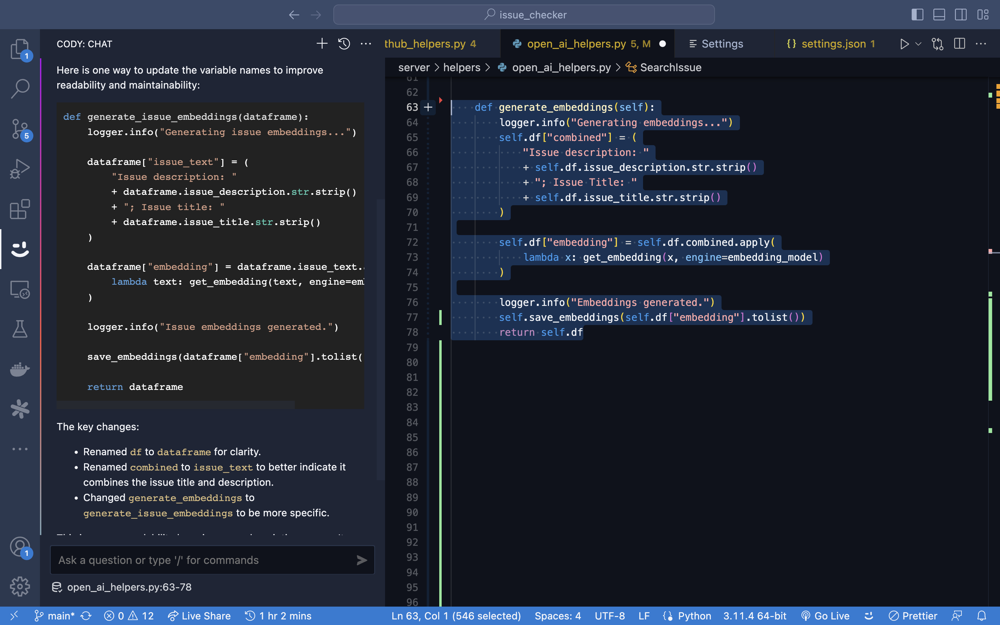
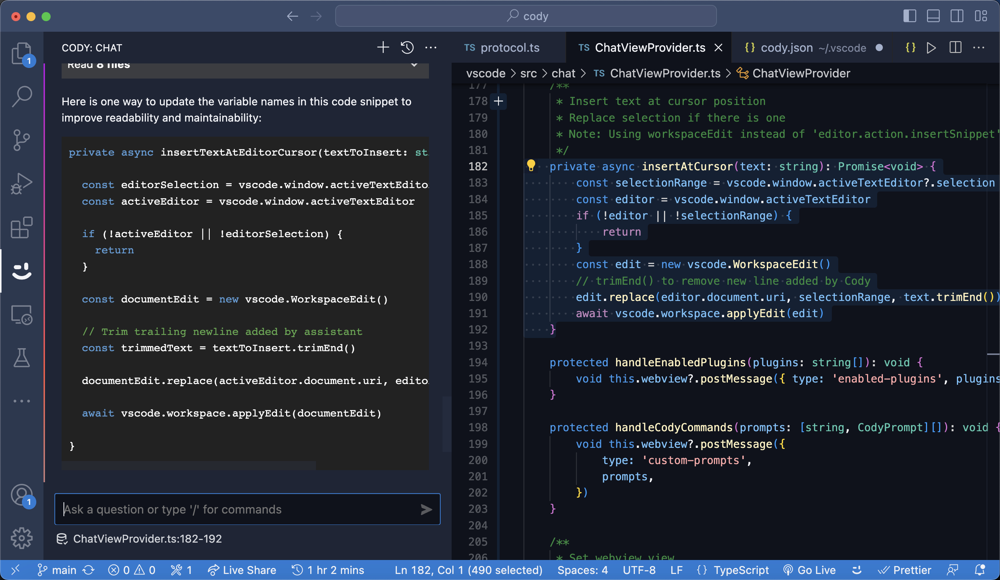

# Cody command: Improve variable names

This command can be used to improve variable names in code by making them more descriptive and self-documenting. 

## Prompt

```json
  "Improve variable names": {
    "prompt": "Suppose that you are writing code for a production level application which is shared by many developers in your team. Take the current code, and update the variable names so that it should improve the readability of the code and help the other developers maintain it without much difficulty.",
    "context": { "codebase": false, "selection": true }
  }
```
> <small>Copy the JSON above and paste it to the bottom of `~/.vscode/cody.json`. </small>

## Examples




